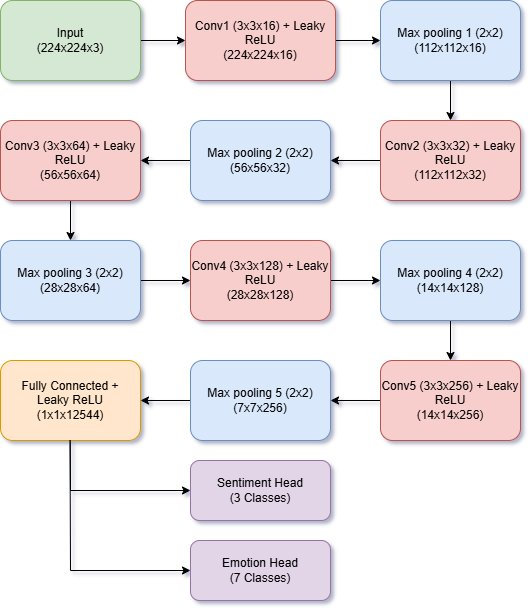
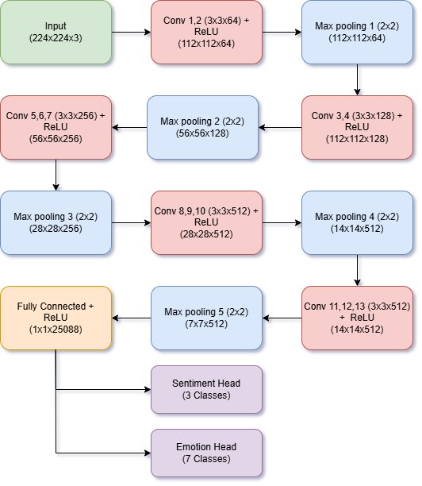
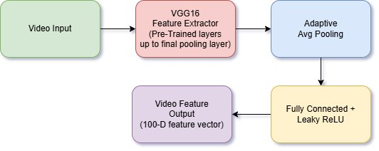
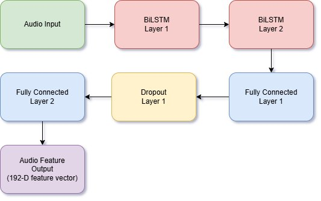
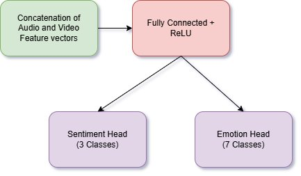
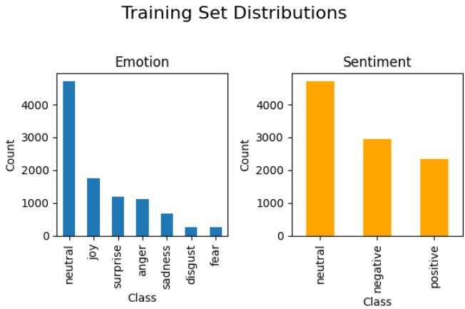
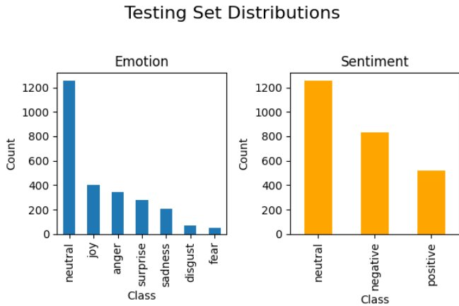
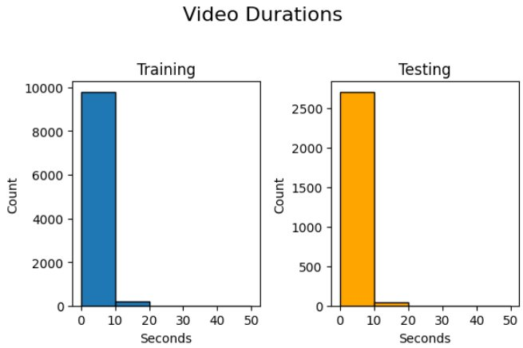

# Multimodal Emotion & Sentiment Recognition

> **Course Project — Deep Learning, Spring 2024**  
> University of North Texas · 4-person team · [Full team repo](https://github.com/TarunSadarla2606/DL_Project)

---

## Overview

Emotion and sentiment classification from **video and audio cues alone** — no text. This project explores how facial expression (visual) and acoustic (audio) signals can jointly predict both:

- **Sentiment**: Positive / Neutral / Negative (3 classes)
- **Emotion**: Anger / Disgust / Sadness / Joy / Neutral / Surprise / Fear (7 classes)

Built on the **MELD dataset** (Friends TV series), which presents real-world challenges: heavy class imbalance (Neutral dominates), short clips, and subtle emotional expression.

**My contributions (visual stream):** frame extraction pipeline, custom 5-layer CNN baseline, pretrained VGG-16 improved model, dual-head multi-task output, full evaluation pipeline.

---

## Architecture

### Visual Stream — Baseline: Custom 5-Layer CNN
A 5-layer convolutional network built from scratch with Leaky ReLU activations, batch normalization, and max pooling. Dual output heads for simultaneous sentiment and emotion prediction.



### Visual Stream — Improved: Pretrained VGG-16
VGG-16 (ImageNet pretrained) with its classification head replaced by two task-specific fully connected heads. Transfer learning provides rich hierarchical visual features without training from scratch.



### Video Feature Branch (for Fusion)
VGG-16 backbone with adaptive average pooling and a fully connected layer producing a compact **100-dimensional video feature vector** for downstream multimodal fusion.



### Audio Branch (teammate's work — for context)
Two stacked BiLSTM layers compress temporal audio features into a **192-dimensional audio feature vector**.



### Multimodal Fusion
Audio (192-D) and video (100-D) feature vectors concatenated and passed through a shared FC layer → dual sentiment + emotion output heads.



---

## Dataset — MELD

**Multimodal EmotionLines Dataset** from the *Friends* TV series.

| Split | Total | Valid |
|---|---|---|
| Training | 9,989 | 9,988 |
| Validation | 1,112 | 1,112 |
| Testing | 4,807 | 2,747 |

**Class distributions (training set):**

| Emotion | Count | Sentiment | Count |
|---|---|---|---|
| Neutral | 4,710 | Neutral | 4,710 |
| Joy | 1,743 | Negative | 2,945 |
| Surprise | 1,205 | Positive | 2,334 |
| Anger | 1,109 | | |
| Sadness | 683 | | |
| Fear | 268 | | |
| Disgust | 271 | | |




**Key challenge:** Neutral dominates (~47% of training data), Fear and Disgust each have fewer than 300 samples — severe class imbalance.



---

## Results

### Visual Stream

| Model | Task | Accuracy | F1 |
|---|---|---|---|
| **5-Layer CNN** | Sentiment | 40.06% | 0.374 |
| **5-Layer CNN** | Emotion | 35.80% | 0.305 |
| **VGG-16 (pretrained)** | Sentiment | **47.52%** | 0.355 |
| **VGG-16 (pretrained)** | Emotion | **48.34%** | 0.315 |

### Naive Baseline (stratified)

| Task | Accuracy | F1 |
|---|---|---|
| Sentiment | 36.21% | 0.364 |
| Emotion | 29.46% | 0.292 |

### Full System Comparison

| Model | Sentiment Acc | Emotion Acc | Macro F1 |
|---|---|---|---|
| Naive Baseline | 36.21% | 29.46% | ~0.30 |
| CNN (visual) | 40.06% | 35.80% | 0.305–0.374 |
| VGG-16 (visual) | 47.52% | 48.34% | 0.315–0.355 |
| BiLSTM (audio) | 48.12% | 48.12% | 0.313 |
| **Multimodal Fusion** | **48.12%** | **48.12%** | 0.217 / 0.093 |

**Key findings:**
- VGG-16 transfer learning improved visual accuracy by ~8% over CNN baseline
- Class imbalance heavily impacts minority emotions — Disgust, Fear get zero recall across most models
- Multimodal fusion didn't improve over individual streams due to simple concatenation and lack of temporal video modeling (1 frame per 3 seconds)
- Future work: attention-based fusion, facial detection, temporal video modeling, class-balancing strategies

---

## Repo Structure

```
multimodal-emotion-recognition/
├── README.md
├── requirements.txt
├── .gitignore
├── data/
│   └── README.md              # MELD dataset download instructions
├── notebooks/
│   ├── dl-cnn.ipynb           # Custom 5-layer CNN — visual baseline
│   └── dl-vgg.ipynb           # Pretrained VGG-16 — visual improved model
├── src/
│   ├── dataset.py             # Frame extraction + FrameLevelMELDDataset
│   ├── models.py              # MELD_CNN and MELD_VGG16 architectures
│   ├── train.py               # Training loop with early stopping
│   └── evaluate.py            # Inference, aggregation, metrics
└── results/figures/           # All architecture diagrams and EDA plots
```

---

## Setup

```bash
git clone https://github.com/TarunSadarla2606/multimodal-emotion-recognition.git
cd multimodal-emotion-recognition
pip install -r requirements.txt
```

Download the MELD dataset — see `data/README.md` for instructions.

---

## My Role

This was a 4-person course project. I served as **project lead** and owned the **visual stream**:

- Frame extraction pipeline from raw MELD `.mp4` clips
- Custom 5-layer CNN architecture and training (`dl-cnn.ipynb`)
- Pretrained VGG-16 fine-tuning with dual-head output (`dl-vgg.ipynb`)
- Video feature branch for multimodal fusion (100-D embedding)
- Full evaluation pipeline — per-class metrics, ROC curves, confusion matrices

Full team repository (includes audio stream and multimodal fusion): [DL_Project](https://github.com/TarunSadarla2606/DL_Project)

---

## Dataset Citation

> Poria et al. MELD: A Multimodal Multi-Party Dataset for Emotion Recognition in Conversations. ACL 2019.

> Chen et al. EmotionLines: An Emotion Corpus of Multi-Party Conversations. arXiv:1802.08379, 2018.
